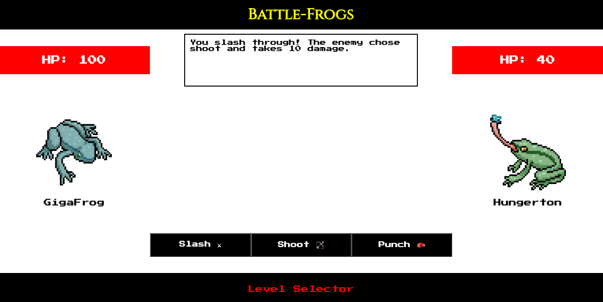

# **Battle-Frogs**
## **Date**: 1/20/2022
### **By**: Anatoliy Agadzhanov
#### [GitHub](https://github.com/yesanatoliy) | [LinkedIn](https://www.linkedin.com/in/anatoliy-agadzhanov-5a2a54173/)
***
### ***Description***
Battle-Frogs is a single-player action game where you fight in the swamp againt other frogs as a battle frog!

***
### ***Technologies Used***
* JavaScript
* HTML
* CSS

***
### ***Screenshots***

#### **Level Selector**

#### **Level One**

***
### ***Future Updates***

- [ ] Make the battle flow more turn-based like with dialogue in between each option
- [ ] Add battle animations
- [ ] Store custom names
- [ ] Make the level selector more interactive
- [ ] Add explicit move types
- [ ] Add experience/leveling system and skill trees for new moves
- [ ] Add more levels, storyline

***
### ***Credits***

Frog images: [adobe stock](https://as2.ftcdn.net/v2/jpg/02/15/04/55/1000_F_215045502_D5elCrL4k6IqcfAaOsGjMMoRi5N1nmLr.jpg) , [adobe stock](https://as1.ftcdn.net/v2/jpg/02/45/90/42/1000_F_245904293_U8Rgkhf9uj32tvLiFqICcHY8hPbonAs8.jpg)

Fonts: [google fonts](https://fonts.google.com/specimen/Press+Start+2P?query=press+start), [google fonts](https://fonts.google.com/specimen/Cinzel?query=cinzel)

Sounds: [epidemicsound.com search](https://www.epidemicsound.com/track/CDR88cZoTI/), [epidemicsound.com search](https://www.epidemicsound.com/track/omfm3pJr6s/), [epidemicsound.com search](https://www.epidemicsound.com/track/snXOduVAib/)

Level images: [unsplash.com search](https://images.unsplash.com/photo-1584282479918-1ea22427dc0f?ixlib=rb-4.0.3&ixid=MnwxMjA3fDB8MHxwaG90by1wYWdlfHx8fGVufDB8fHx8&auto=format&fit=crop&w=2670&q=80), [unsplash.com search](https://images.unsplash.com/photo-1601027847350-0285867c31f7?ixlib=rb-4.0.3&ixid=MnwxMjA3fDB8MHxwaG90by1wYWdlfHx8fGVufDB8fHx8&auto=format&fit=crop&w=2574&q=80)

Positioning guide: [W3 schools css position guide](https://www.w3schools.com/css/css_positioning.asp)

